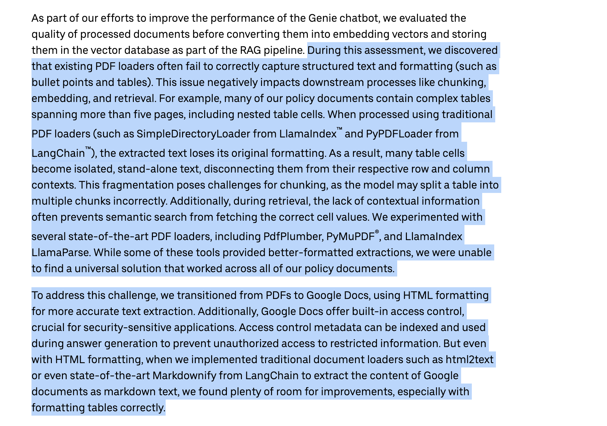

[Watch Walkthrough Video](public/walkthrough.mp4)

This project shows three different ways to parse PDF files:

1. Using pdf-parse
2. Using OpenAI LLM (we can also use other LLMs)
3. Using Reducto (https://reducto.ai/)

The best method depends on your needs and what trade-offs we are willing to make. These are basic implementations. For better quality or specific use cases, we may need to optimize further. I'm assuming this assignment needs a basic implementation (let me know if I'm wrong).

pdf-parse Approach:
Pros: Fast, free, no API calls needed, works well for plain text PDFs
Cons: Struggles with complex layouts, tables, images, or scanned PDFs

OpenAI API Approach:
Pros: Handles complex layouts, tables, and images well, preserves document structure
Cons: Cost, slower than other methods, and we can't parse pdf with many pages

Reducto Approach:
Pros: Built specifically for document parsing, provides structured output
Cons: High cost

Other Tools:
You can also use other tools like:

- LlamaParse: https://developers.llamaindex.ai/python/cloud/llamaparse/
- Langchain PDF parser: https://docs.langchain.com/oss/python/integrations/document_loaders/parsers/writer_pdf_parser

Note:
Long back, I read an article from Uber (https://www.uber.com/en-GB/blog/enhanced-agentic-rag/) about how they built an on-call copilot that can access all of Uber's internal documentation (PDFs, Docs, etc.). They mentioned that for better format handling and performance, they needed to build their own custom parser. During their assessment, they found that existing PDF loaders often fail to correctly capture structured text and formatting like bullet points and tables, especially with complex tables spanning multiple pages. This formatting loss negatively impacts downstream processes like chunking, embedding, and retrieval, as table cells become isolated text disconnected from their row and column contexts. They experimented with several PDF loaders including PdfPlumber, PyMuPDF, and LlamaParse, but couldn't find a universal solution. To address this, they transitioned to Google Docs using HTML formatting for more accurate text extraction, which also provides built-in access control for security. However, even with HTML formatting, traditional document loaders like html2text and Markdownify still struggled with correctly formatting tables.

